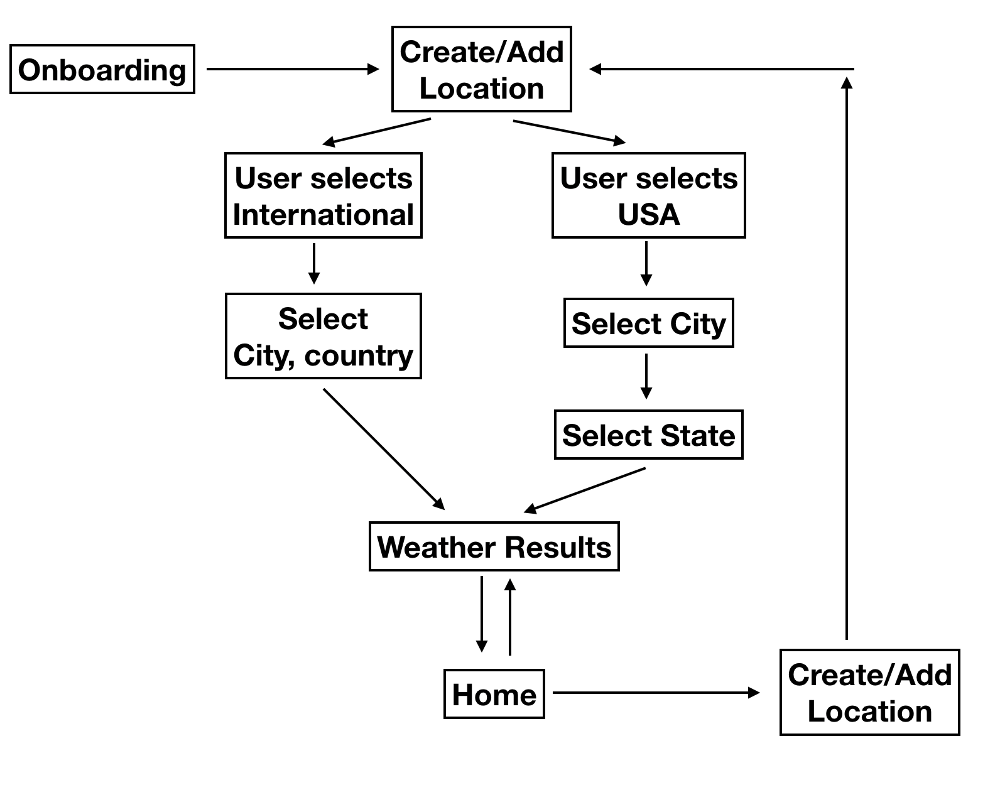
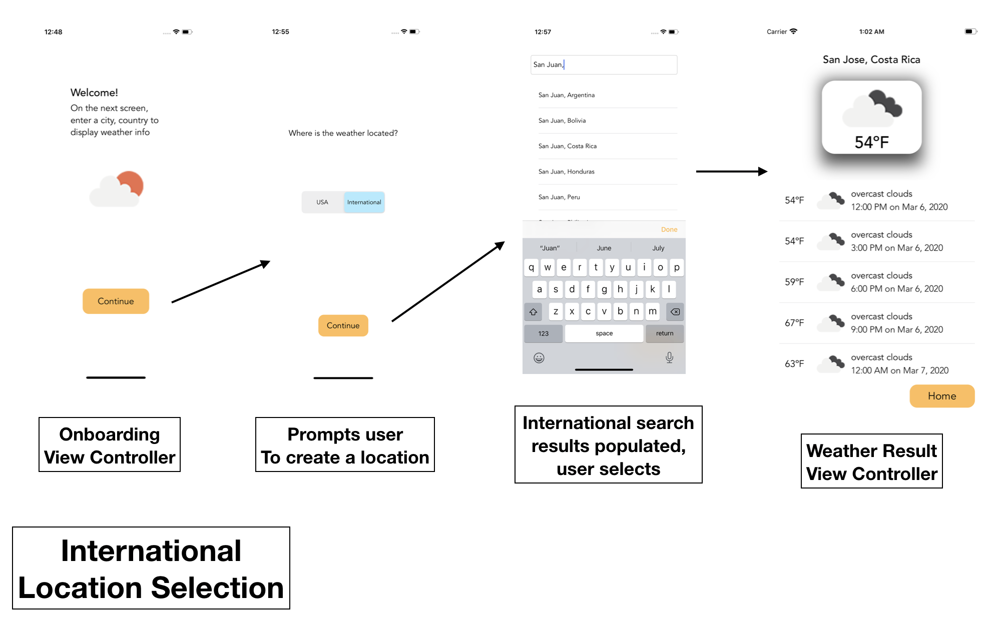
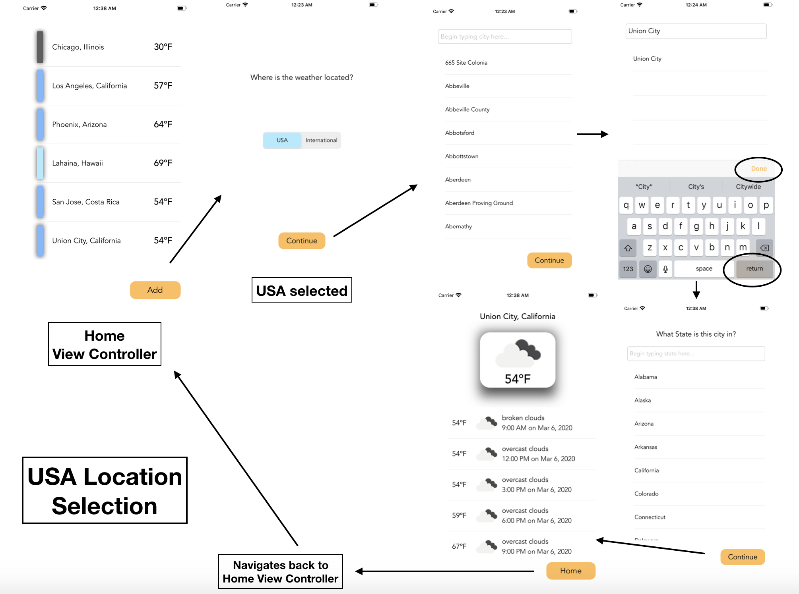
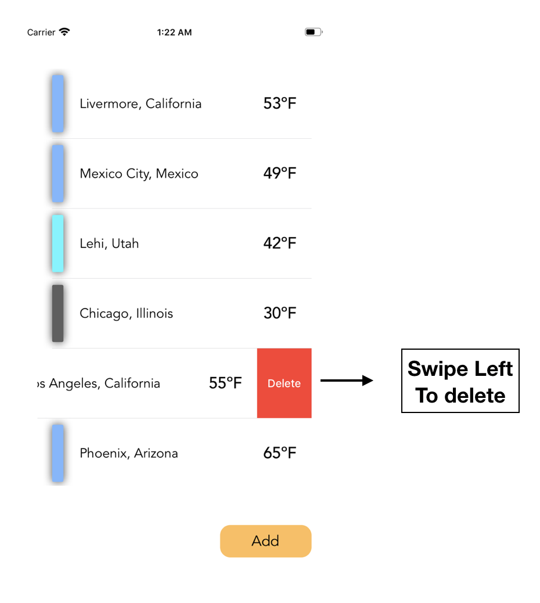

# OnrampProject

### Weather App Overview
In this app, a user creates a location of interest to view the 5 day forecast of the weather with 3 hour updates. The data is dervied from OpenWeatherMap API. 
The user has the option to select a location within the United States (USA) or internationally. This allows the for filtering a default JSON file to display
to the user only cities in the United States or simply a 'city, country' internationally. Their saved locations are persisted throughout the app, and are seen in
tbe 'Home View Controller,' which acts as the central view controller. From this spot in the app a user can create another location to be saved to their list.  

### Architectural Overview of Weather App
The App begins with an onboarding view controller, then navigates to create a location (USA or Internationally), and after the location has been created,
the weather results view controller is displayed. At this point the user can navigate between the weather results view controller and the 
Home View Controller. While on the Home View Controller a new locations can be added to the persisted locations.

### Overview of an International Location Created 
The international location dispalys decoded JSON data as a 'city, country' on the tableview cells, making it the shortest process. 

### Overview of an USA location Created
The USA location has an extra step than the international location, where a user is prompted to enter the State where the selected city 
is located. 

### Home ViewController (Deleting Locations)
This is the central location of the app, where users can view all their saved locations, select one to view the weather, and delete a location. 
From this view controller, the "Add" Button leads a user to create a new location. 

### Design Patterns Utilized 
• 7 UIViewControllers embedded in a UINavigationController.

• 1 UIView to display the current weather, added shadowing for UIView to stand out in view along with a UIImageView and label.

• MVVM architectural pattern, also a styleGuide for customUI elements, extended UIView, UIColor, UIButton, and added a HelperUI class.

• OpenWeatherMap REST API, decode JSON data for a 5 day weather forecast at a specific city, state/country.

• Several UIView/UIControl subclasses which include UITableViews, UISegmentedControl, UIButtons, UITextFields, UIStackViews, UIImageView, UILabel, and UIAlertControl.

• Used UserDefaults for data persistence. Stored users saved locations and first launch of app status for onboarding purposes.

### ViewControllers Outlined (Description/Purpose and Components)

### LaunchViewController
Retrieves user defaults, to check if its the First or Second Launch of the app. This will tell which view controller
to push to the navigation state.

• UIImageView 
 
### OnboardingViewController 
First time a user logins into app, presented with a welcome message on what to do to proceed with viewing
weather at specific locations.

• UILabel (2)

• UIImageView

• UIButton 

### UserLocationsViewController 
Displayed the stored locations from User Defaults, acts as the 'Home ViewController'. OpenWeatherMap REST API call is executed here to dispay preview the current temperature and update the UIView color (vertical rectangle) to match the temperature. A tableview cell can be selected and will be navigated to the weather of that selected location.  Also, a new location can be added in this view controller.

• UITableView

• UILabel(2)

• UIButton 

• UIView (note: vertical rectangle color changes with differentiating temperatures)

### DefaultLocationsViewController 
If USA is selected, only USA cities are displayed in the tableview. If International is selected,
then a "city, Country" is displayed in the tableview. A user selects the designated locations and continues. 

• UITextField

• UITableView

• UIButton 

### CountrySelectionViewController  
Asks a user to select USA or International to continue creating a location. 

• UILabel

• UISegmentedControl

• Button 

### StatesViewController 
This only is displayed when a user is creating a USA location, a list of the 50 United States are displayed
in the tableview.

• UILabel 

• UITextField

• UITableView

• UIButton 

### WeatherViewController 
The weather is displayed, the top of the view is the current weather. The weather results in the tableview
are 5 day forecast, every 3 hour weather. OpenWeatherMap REST API called and used to display UI elements. 

• UILabel(5)

• UIView

• UIImageView(2)

• UITableView

• UIButton
